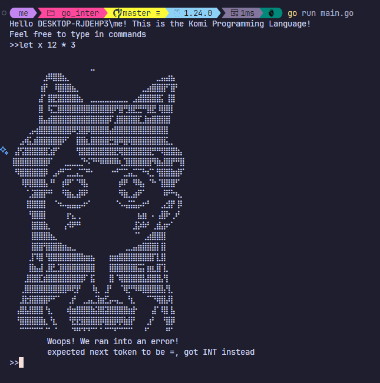

# Interpreter in Golang

This project is an interpreter for a simple programming language written in Go. The interpreter supports mathematical expressions, variable
bindings, functions and the application of those functions, conditionals, return statements and
even advanced concepts like higher-order functions and closures. And then there are the different
data types: integers, booleans, strings, arrays and hashes.

## Project Structure

### Directories

- **ast/**: Contains the Abstract Syntax Tree (AST) definitions and related functions.
- **evaluator/**: Contains the evaluator implementation which executes the AST.
- **lexer/**: Contains the lexer implementation which is responsible for tokenizing the input source code.
- **object/**: Contains the object system which defines the data types used in the interpreter.
- **parser/**: Contains the parser implementation which converts tokens into an AST.
- **repl/**: Contains the Read-Eval-Print Loop (REPL) implementation for interactive use.
- **token/**: Contains the token definitions used by the lexer and parser.

## Getting Started

### Prerequisites

- Go 1.24.0 or later

### Building the Project

To build the project, run:

```sh
go build
```

### REPL

To run REPL, run:

```sh
go run main.go
```

## Error


